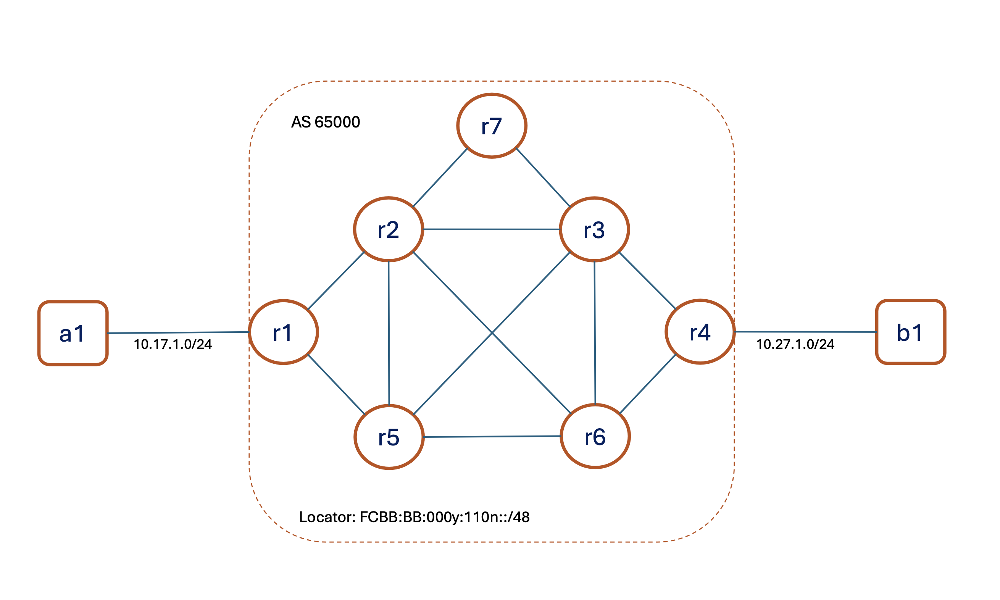

# Containerlab Catalyst 8000v

This is a 7-node topology running Catalyst 8000v (IOS XE) on Containerlab. 

This demonstrates a Layer 3 IPv4 VPN (vpnv4) over an SRv6 enabled topology. This lab has been tested on Ubuntu 24.04.2, Containerlab 0.67, with IOS XE 17.12.04b

Lab topology: 

 
