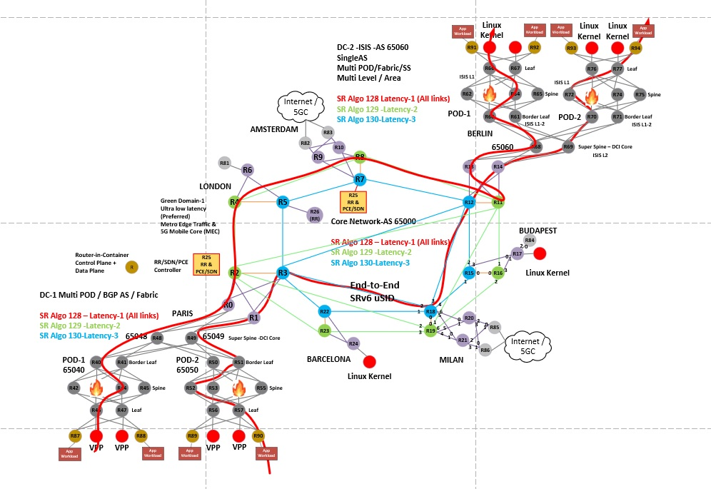

#### SRv6-labs/3-srv6-dc-case-studies/xrdcompose-multi-pod "Use-Case 2 Multi POD DC"
#### 3 config flavors all use the same topology
* config-v6-vDC   (vanilla DC)      "Host Networking"	   YouTube Video 4 of 9
* config-v6-vCore (vanilla Core)    "Migration"		   YouTube Video 5 of 9
* config-v6-only  (end-end-SRv6)    "SRv6 uSID End to End"  YouTube Video 6 of 9


## Launch an XRd topology on baremetal, Ubuntu VM, or AWS instance 
### This doc is based on Ubuntu 20.04

If using AWS I recommend EC2 instance t3a.xlarge or larger for a 6 node topology

1. Copy files from this repo to your host or VM
2. Acquire and upload an XRd image:

      XRd's CCO download site: https://software.cisco.com/download/home/286331236/type/280805694/release/7.7.1

3. Install docker https://docs.docker.com/engine/install/ubuntu/
4. Install docker-compose: 
```
sudo apt install docker-compose
```
5. Optional - to run docker commands without sudo:  
```
sudo usermod -aG docker $USER

// Then logout and log back in
```

6. Untar and load your image:
```
tar -xvf xrd-control-plane-container-x64.7.7.1.tgz 
docker load -i xrd-control-plane-container-x64.dockerv1.tgz

```
7. check image status: 
```
docker images

// should output something like: 

REPOSITORY           TAG         IMAGE ID       CREATED         SIZE
localhost/ios-xr     7.7.1       dd8d741e50b2   2 months ago    1.15GB
```

8. Add these lines to the end of /etc/sysctl.conf  
```
net.bridge.bridge-nf-call-iptables=0
net.bridge.bridge-nf-call-ip6tables=0
fs.inotify.max_user_instances=65536
fs.inotify.max_user_watches=65536
```
9. Reload sysctl:  
```
sudo sysctl -p
```
10. Run host check script to validate we have sufficient server/VM resources:  
```
./host-check 
```   
   You may see hugepages and IOMMU errors/warnings. I proceeded without addressing these.
  
11. Optional: dry run script 
```
./launch-xrd --dry-run localhost/ios-xr:7.7.1 --platform xrd
```
12. Launch the topology 
``` 
./xr-compose -f docker-compose-6-node.yml -i localhost/ios-xr:7.7.1 -l

or

./xr-compose -f docker-compose-4-node.yml -i localhost/ios-xr:7.7.1 -l
  
```
12. check containers: 
```
docker ps
```
13. access XR cli (note, it will take a couple minutes for the containers to build, so cli won't be immediately available):
```
docker exec -it xrd27 /pkg/bin/xr_cli.sh
```

14. Cleanup example: 4-node topology (or just run ./cleanup.sh script)
```
docker-compose down
docker volume rm xrd91
docker volume rm xrd92
docker volume rm xrd93
docker volume rm xrd94

```


### 27 node topology
Tested on bare metal with 32 vCPU and 96G of memory.
It does require some additional tuning:

1. Increase Docker default-address-pools by adding something like following to /etc/docker/daemon.json

```
{
  "default-address-pools" : [
    {
      "base" : "172.17.0.0/12",
      "size" : 20
    },
    {
      "base" : "192.168.0.0/16",
      "size" : 24
    }
  ]
}
```

2. Increase the docker-compose parallel limit and timeout threshold:
```
export COMPOSE_PARALLEL_LIMIT=1000
export DOCKER_CLIENT_TIMEOUT=600
export COMPOSE_HTTP_TIMEOUT=600

```

3. Boost /etc/sysctl.conf inotify params even further
```
fs.inotify.max_user_watches=131072
fs.inotify.max_user_instances=131072
```

#### SRv6-labs/3-srv6-dc-case-studies/xrdcompose-multi-pod "Use-Case 2 Multi POD DC"
#### 3 config flavors all use the same topology


### Topology - config-v6-vDC   (vanilla DC)      "Host Networking"	   YouTube Video 4 of 9


### Topology - config-v6-vCore (vanilla Core)    "Migration"		   YouTube Video 5 of 9


### Topology - config-v6-only  (end-end-SRv6)    "SRv6 uSID End to End"  YouTube Video 6 of 9

